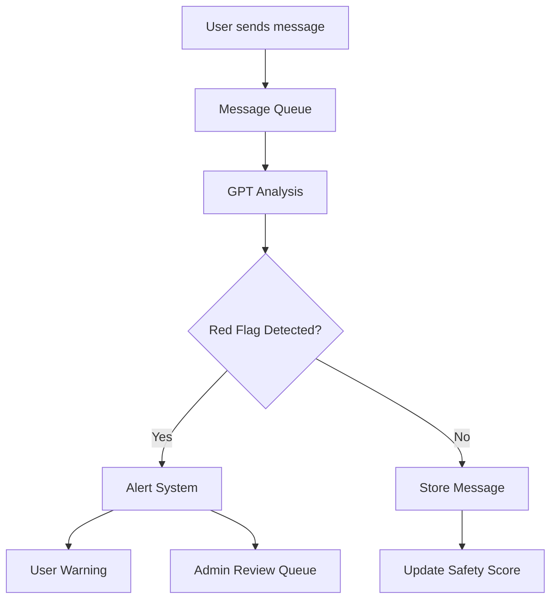

# AI Red Flag Detection System for Harvest

## Overview

The AI Red Flag Detection System is designed to protect users by identifying potentially harmful behavior patterns, suspicious requests, and unsafe interactions. This system works in conjunction with the "Ready to move off the app?" feature to ensure user safety during the critical transition period.

## Core Components

### 1. Message Analysis Engine

The system will analyze messages in real-time for:

#### **Immediate Red Flags (High Priority)**

- **Financial Requests**: Asking for money, investment opportunities, cryptocurrency
- **Personal Information Harvesting**: SSN, bank details, passwords, security questions
- **Rapid Escalation**: Moving to personal contact too quickly (< 24 hours of matching)
- **Emergency Scams**: Sudden emergencies requiring financial help
- **Catfishing Indicators**: Refusing video calls, inconsistent story details
- **Location Tracking**: Excessive questions about exact location, daily routines

#### **Behavioral Red Flags (Medium Priority)**

- **Love Bombing**: Excessive affection/commitment very early
- **Gaslighting Language**: Denying previous statements, manipulative phrases
- **Controlling Behavior**: Demands for exclusive attention, jealousy about other matches
- **Pressure Tactics**: Rushing intimacy, pushing boundaries after "no"
- **Isolation Attempts**: Discouraging friends/family involvement
- **Negging**: Backhanded compliments, undermining self-esteem

#### **Content Red Flags (Variable Priority)**

- **Inappropriate Content**: Unsolicited explicit images or requests
- **Harassment**: Repeated messages after no response, aggressive language
- **Hate Speech**: Discriminatory language, threats
- **Spam/Bot Behavior**: Copy-pasted messages, promotional content

### 2. "Ready to Move Off App" Safety Gate

When users toggle "Ready to move off the app?", the AI will:

#### **Pre-Move Analysis**

```javascript
interface PreMoveAnalysis {
  conversationDuration: number; // hours since first message
  messageCount: number;
  redFlagCount: number;
  safetyScore: number; // 0-100
  videoCallCompleted: boolean;
  profileVerified: boolean;
}
```

#### **Safety Recommendations**

- **Green Light** (Safety Score 80-100): Safe to share contact info
- **Yellow Light** (Safety Score 50-79): Caution advised, suggest video call first
- **Red Light** (Safety Score 0-49): Strong warning, block sharing temporarily

### 3. GPT Integration Architecture

#### **API Configuration**

```javascript
const openaiConfig = {
  model: 'gpt-4-turbo-preview',
  temperature: 0.3, // Lower for more consistent safety detection
  max_tokens: 500,
  system_prompt: SAFETY_ANALYSIS_PROMPT,
};
```

#### **Safety Analysis Prompt Template**

```
You are a safety AI for a dating app. Analyze the following conversation for red flags.

Context:
- User A (analyzer): {userProfile}
- User B (match): {matchProfile}
- Conversation duration: {duration}
- Messages exchanged: {messageCount}

Recent messages:
{recentMessages}

Analyze for:
1. Financial scams or requests
2. Personal information harvesting
3. Catfishing indicators
4. Manipulative behavior
5. Inappropriate content
6. Pressure tactics

Return JSON:
{
  "safetyScore": 0-100,
  "redFlags": [{
    "type": "category",
    "severity": "high|medium|low",
    "message": "specific concern",
    "evidence": "quote from conversation"
  }],
  "recommendations": ["actionable advice"],
  "allowContactSharing": boolean
}
```

### 4. Real-time Detection Pipeline



### 5. User-Facing Features

#### **Safety Dashboard**

```typescript
interface SafetyDashboard {
  overallSafetyScore: number;
  matchSafetyScores: Map<string, number>;
  recentWarnings: Warning[];
  safetyTips: string[];
  emergencyContacts: Contact[];
}
```

#### **Warning System**

- **Subtle Warnings**: Small badge on chat
- **Medium Warnings**: Pop-up with explanation
- **Severe Warnings**: Block action with mandatory review

#### **Education Components**

- Onboarding safety tutorial
- Weekly safety tips
- Red flag recognition guide
- Safe meeting guidelines

### 6. Implementation Phases

#### **Phase 1: Foundation (Week 1)**

- Set up GPT API integration
- Create message analysis service
- Implement basic red flag detection
- Add safety score calculation

#### **Phase 2: Real-time Analysis (Week 2)**

- Integrate with chat system
- Add message queue processing
- Implement warning UI components
- Create safety dashboard

#### **Phase 3: "Ready to Move" Integration (Week 3)**

- Add pre-move safety analysis
- Implement contact sharing controls
- Create recommendation engine
- Add video call verification prompt

#### **Phase 4: Advanced Features (Week 4)**

- Pattern learning from user reports
- Community safety scores
- Anonymous safety reviews
- Emergency button integration

### 7. Database Schema

`

````

### 8. API Endpoints

```typescript
// Message analysis
POST /api/safety/analyze-message
{
  conversationId: string;
  messageId: string;
  content: string;
  senderId: string;
}

// Pre-move safety check
POST /api/safety/ready-to-move-check
{
  conversationId: string;
  userId: string;
  matchId: string;
}

// Report red flag
POST /api/safety/report
{
  reporterId: string;
  reportedUserId: string;
  conversationId: string;
  flagType: string;
  evidence: string;
}

// Get safety dashboard
GET /api/safety/dashboard/:userId
````

### 9. Privacy & Ethical Considerations

#### **Data Handling**

- Messages analyzed but not stored by GPT
- Analysis results encrypted at rest
- User consent required for AI monitoring
- Option to opt-out with warnings

#### **False Positive Handling**

- Appeal process for warnings
- Human review for severe actions
- Continuous model improvement
- Transparency in detection criteria

#### **User Education Priority**

- Focus on empowerment, not fear
- Clear explanation of all warnings
- Resources for safe dating practices
- Support resources for victims

### 10. Success Metrics

```typescript
interface SafetyMetrics {
  // Detection metrics
  redFlagsDetected: number;
  falsePositiveRate: number;
  responseTime: number; // ms

  // User safety metrics
  unsafeInteractionsPrevented: number;
  safeMovesOffApp: number;
  userReportsValidated: number;

  // Engagement metrics
  safetyFeatureAdoption: number; // percentage
  educationContentViews: number;
  emergencyButtonUses: number;
}
```

### 11. Testing Strategy

#### **Unit Tests**

- Red flag pattern matching
- Safety score calculation
- GPT response parsing
- Warning threshold logic

#### **Integration Tests**

- Real-time message processing
- Chat integration
- Database operations
- API endpoint responses

#### **User Testing**

- Warning clarity and effectiveness
- False positive feedback
- Feature discoverability
- Emergency response time

### 12. Future Enhancements

- **Machine Learning**: Train custom model on reported conversations
- **Behavioral Analysis**: Pattern detection across multiple conversations
- **Community Safety Network**: Shared blacklists (with privacy)
- **Voice/Video Analysis**: Extend to call safety
- **Background Checks**: Optional integration with verification services
- **AI Coaching**: Proactive safety suggestions during conversations

## Implementation Priority

1. **Critical**: Basic red flag detection for financial scams and explicit content
2. **High**: "Ready to move off" safety gate
3. **Medium**: Real-time analysis and warnings
4. **Low**: Advanced ML and community features

## Configuration

```javascript
// lib/ai/safetyConfig.ts
export const SAFETY_CONFIG = {
  // GPT settings
  openai: {
    apiKey: process.env.OPENAI_API_KEY,
    model: 'gpt-4-turbo-preview',
    temperature: 0.3,
    maxTokens: 500,
  },

  // Detection thresholds
  thresholds: {
    immediateBlock: 20, // safety score
    warning: 50,
    caution: 70,
    safe: 80,
  },

  // Time gates
  minimums: {
    hoursBeforeSharing: 24,
    messagesBeforeSharing: 20,
    daysBeforeOffApp: 3,
  },

  // Feature flags
  features: {
    aiMonitoring: true,
    autoWarnings: true,
    contentBlurring: true,
    videoVerification: false, // Phase 2
    communityReporting: false, // Phase 3
  },
};
```

## Notes for Implementation

- Start with rule-based detection, add AI gradually
- Prioritize user privacy and consent
- Balance safety with user experience
- Regular updates based on new scam patterns
- Clear communication about AI involvement
- Human review for all automated actions
